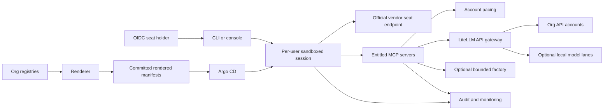

# Agent-array

Agent-array is a self-hosted multi-user agentic coding platform on Kubernetes: per-user
sandboxed vendor CLI sessions, multi-account pacing, a LiteLLM gateway over organisation
API accounts, an entitled MCP/context layer, and an optional local-model factory.
It is for platform teams that need identity, tenant isolation, spending attribution,
reviewable configuration and operational control over coding agents.

The session plane and admission are the most mature; the multi-user layers are new in
this export and need a pilot. Offline tests prove contracts, not production readiness.
Vendor, legal, security and live verification gates precede production adoption.

## Ten-minute tour

Use Git, Python 3.10+ and Make. This local tour does not deploy a cluster.

```sh
git clone git@github.com:example-org/agent-array.git
cd agent-array
cp org/org.example.yaml org/org.yaml
cp org/teams.example.yaml org/teams.yaml
cp org/users.example.yaml org/users.yaml
cp org/accounts.example.yaml org/accounts.yaml
cp org/estates.example.yaml org/estates.yaml
cp mcp/registry.example.yaml mcp/registry.yaml
cp mcp/context-sources.example.yaml mcp/context-sources.yaml
```

Update org.yaml `files` references to those copies. Inspect Example Org's payments/platform
teams, Ana's `aa-u-ana` namespace, seat bindings and API pools. Keep secrets as name/key
references. Deployment values and example zero image digests require replacement before
strict rendering or deployment; non-strict example rendering may warn.

```sh
make render
# Inspect rendered/global, rendered/users and rendered/files locally.
make test
```

Inspect per-user RBAC, claims, policies, model budgets and MCP entitlements. Follow
[adoption](docs/ADOPTION.md) for real deployment and [org configuration](org/README.md)
for schema details.

## Architecture



## Documentation map

| Goal | Guide |
|---|---|
| Supervise sessions and route permission requests | [Session supervision](docs/SUPERVISION.md) |
| Planes, concepts and trust boundaries | [Architecture](docs/ARCHITECTURE.md) |
| Evaluate, bootstrap and migrate | [Adoption](docs/ADOPTION.md) |
| Manage people, accounts and limits | [Multi-user](docs/MULTI-USER.md) |
| Connect tools and context | [MCP and context](docs/MCP-AND-CONTEXT.md) |
| Assess threats and residual risk | [Threat model](docs/SECURITY.md) |
| Run, restore and respond | [Operations](docs/OPERATIONS.md) |
| Adapt with coding agents | [Agent guide](AGENTS.md) |
| Contribute and understand decisions | [Contributing](CONTRIBUTING.md), [ADRs](docs/adr/README.md) |
| Resolve terminology | [Glossary](docs/GLOSSARY.md) |

Core guides: [cluster](cluster/README.md), [GitOps](argocd/README.md),
[sessions](sessions/README.md), [gateway](llm/README.md), [pace](services/pace/README.md),
[MCP](mcp/README.md), [farm MCP](services/farm-mcp/README.md), [CLI](tools/aa/README.md),
[panel](portal/panel/README.md), [monitoring](monitoring/README.md),
[renderer](tools/render/README.md) and [CI](tools/ci/README.md).

## Optional modules

The [module index](modules/README.md) covers factory, gpu-lanes, session-jobs, pkg-mirror,
wazuh, hostwatch, seccomp-gvisor, hostguard, hermes-ops-chat, workstation-lane,
arc-ci, k3s-baremetal and k3s-maintenance. Each starts disabled and uses
`modules.<name>.enabled`; enable individually after verification.

## Licence and disclosure

The copyright holder and adopting organisation must confirm the Apache-2.0 licence choice
before publishing. Complete [NOTICE](NOTICE) and [disclosure](SECURITY.md) placeholders.
See [LICENSE](LICENSE) and [changelog](CHANGELOG.md).
