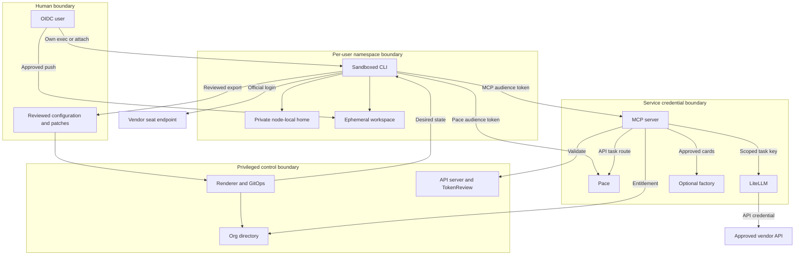

# Architecture

Human seat sessions and API-driven automation have separate credential and lifecycle
boundaries. Authored registries define identity, accounts and data policy; deterministic
rendering produces reviewed GitOps state. See [adoption](ADOPTION.md) and [security](SECURITY.md).

## Concepts

### Sessions and control authority

A session is a tool process with an actor, workspace, account binding and lifecycle.
Interactive seats begin turns when their seat holder connects and supplies input.
Headless automation is a separately authorised API task with a budget, timeout and result
contract. Listener readiness does not start a model turn.

A spawned session has recorded platform creation provenance and actor/account attribution.
A discovered session already exists; observing it grants no permission to drive it.
Identity and consent must be established before input is accepted. Only the holder drives
an interactive seat. Authorised controllers may drive API tasks within their scopes;
administrative intervention requires recorded break-glass.

### Homes and registry-driven responsibility

Each user/tool/home-node tuple has a private login home. Disk homes survive pod replacement
on that node, but never move between nodes or users. Refresh-token rotation and account
boundaries make copying logins unsafe; moving a session requires revocation and fresh login.
Workspaces are separate ephemeral data and require export before restart.

Registries bind immutable user subjects to never-reused slugs, teams to entitlement/budget
policy, accounts to spending access, and estates to approved context. Caller-supplied team
names do not prove membership. Services resolve responsibility from authenticated identity
and the rendered directory.

### Pacing and permissions

Per-account windows have a cap and reserve. Leases bound concurrency and start spacing;
replicas never multiply allowance. Automation routes select entitled API/local pools with
headroom and compatible classification. Seats never appear in automation routes.

Risky actions use permission tiers: automatic for bounded pre-authorised actions,
policy-engine approval for contextual checks against scope and limits, and human approval
for privileged, destructive or external publication actions. Ambiguity denies or escalates.
CLI permission modes cannot override admission, data gates or account rules.

### Input, output and stopping

An input gate binds instructions to an authorised actor, session, data class and action
scope. Context is untrusted data and cannot grant authority. Output redaction removes
credentials and sensitive data before display, export or logging; it complements
classification and is not a complete DLP implementation. A stop governor bounds turns,
retries, spend and elapsed time, interrupts cancellation/policy violations, and records
the stop reason. These are supervision extension concepts, not a claim that complete
supervision is implemented in this export.

### Outbound console connectors

A console connector initiates outbound authenticated connections to an approved control
endpoint. Sessions expose no inbound listener. Commands remain attributable and require
identity/scope checks; invalid input fails closed. Proxy authentication alone grants no
session authority.

### Control, permission and relay extension contracts

Session kinds determine drivability: platform-spawned sessions have full holder control;
terminal-multiplexer sessions use their recorded handle; headless processes without a
handle support signals only; transcript-only sessions are read-only. Authorise every
command when it runs. Named automation identities never start interactive seats, and
break-glass only lists, reads, interrupts or stops with an audited ticket.

Before leasing, check explicit per-account/per-user refusals and advise on stale usage
or near-cap readings. Permission defaults are automatic reads/workspace writes, policy
engine network checks, and human approval for money, outside contact, irreversible
changes and access changes. The engine may only deny/escalate those four categories
unless a team opts in. Notify once per request and deny on timeout. Bypass permission
modes skip routing; cluster guardrails remain the hard floor.

Redaction covers live output, listings, notifications, policy/adapter payloads, errors,
audit details and logs. Outbound connectors use a dedicated rotating credential per
instance, never a user-token signing key; consoles compare against all configured values
in constant time. Work items link through the CLI session ID, never titles/window names.
Notifier and work-item adapters have bounded failure handling and an explicit interface.
Every control remains available without a console through a holder-only local interface
that the CLI cannot reach. These are extension requirements, not implemented supervision.

Registry git identity controls commit authorship. Forge credentials are per-user named
Secrets, provisioned at onboarding and revoked at offboarding; a home credential grants
no platform authority.

## Planes

| Plane | Responsibility and boundary |
|---|---|
| Identity | OIDC subjects/groups; issuer, audience, expiry and application authorisation |
| Control/GitOps | Registries, renderer, reviewed Git and Argo CD; manual policy/secret sync |
| Session | Per-user namespaces, StatefulSets, private homes, quota and admission |
| Model gateway | LiteLLM team models/budgets and task keys over organisation API accounts |
| MCP/context | Entitled tools and classified sources; each server enforces auth, no central gateway in v1 |
| Factory | Optional approved bounded cards, lead approval, fair share and deterministic checks |
| Observability | Metadata audit, metrics, alerts and protected retention |
| Egress | Default-deny, explicit peers, vendor routes and optional exact-host gateways |

A compute lane is a model-serving resource with explicit input, concurrency and quality
limits. It grants no identity or data-policy exemption. Register each backend once;
duplicating router entries can multiply apparent concurrency beyond physical slots.

## Trust boundaries and data flow

Node/root administrators, storage controllers and control-plane admins remain trusted:
they can access or replace isolation mechanisms. Namespace isolation is not protection
against cluster-root compromise. Dedicated session nodes reduce CI/controller coupling.
Service results return as untrusted content.

## Per-user object model

Example Org's Ana maps to `aa-u-ana`, labelled user-sessions and annotated with OIDC subject.
It contains `session` ServiceAccount, holder RoleBinding, quota/LimitRange, default-deny,
managed policy, entitled MCP ConfigMaps and context policy. `(ana, claude, node-a)` produces
`claude-node-a` and `claude-home-node-a`. Suspended users render zero replicas; offboarded
users render no session objects. Retained storage deletion requires explicit offboarding.

Placement uses role/runtime labels; only login PV/pod placement may pin the configured home
node. Holders inspect, attach and scale permitted own workloads, never create arbitrary
pod specs, read Secrets or change managed policy.

## Credential locations

| Material | Location and permitted consumers |
|---|---|
| Human OIDC authentication | Client/IdP flow; individual identity, no shared daily admin certificate |
| Vendor seat login | Private user/tool/node PVC exposed to that user's official CLI; never copied/backed up |
| Provider API keys | Named Secrets in model-gateway namespace; gateway only |
| LiteLLM master/database credentials | Gateway namespace, never supplied to mint clients |
| Restricted mint keys | Panel/farm namespaces, key-management routes only |
| Task virtual keys | Authorised API-task service or credential-bearing task runner, never interactive seat pods or untrusted testers |
| MCP upstream credentials | Server Secret, server pod only |
| Registry pull credentials | Namespace Secret used by kubelet; not mounted in session containers |
| Sealing private keys | Controller and separately encrypted recovery custody |
| Backup/connector/notifier credentials | Dedicated service or host scope and protected recovery custody |
| MCP/pace pod identity | Explicit projected tokens, distinct audiences, at most 3600 seconds |

No Kubernetes Secret values, API keys or upstream credentials reach interactive sessions.
Their private seat login is persistent authentication state; projected audience-bound MCP
and pace tokens are the only allowed ServiceAccount tokens. Automatic token mounting is
disabled and no API-server audience is accepted. No plaintext belongs in Git, images,
ConfigMaps or rendered configuration. Sealed ciphertext is committed only through the
organisation's reviewed sealing workflow.

## Rendering pipeline

`org/org.yaml` references teams, users, accounts, estates and MCP/context registries.
[Rendering](../tools/render/README.md) validates references, merges component defaults,
substitutes exact `{{KEY}}` tokens and expands user/user-tool/team/node/MCP/account scopes.
Unknown keys fail; plugins are deterministic and disabled modules emit nothing.

Manifests go into `rendered/global/`, `rendered/users/` or `rendered/mcp/` as appropriate;
non-manifest configuration goes into `rendered/files/`, with other entities in their
dedicated scopes. [Argo CD](../argocd/README.md) reads committed rendered manifests only.
Regenerate outputs rather than hand-editing. Services mount org-directory read-only at
`/etc/agent-array/org/` as the common identity/account contract. Policy and secret apps
use manual sync with prior-state capture and rollback review.

Cross-component interfaces are defined in [contracts](CONTRACTS.md).
